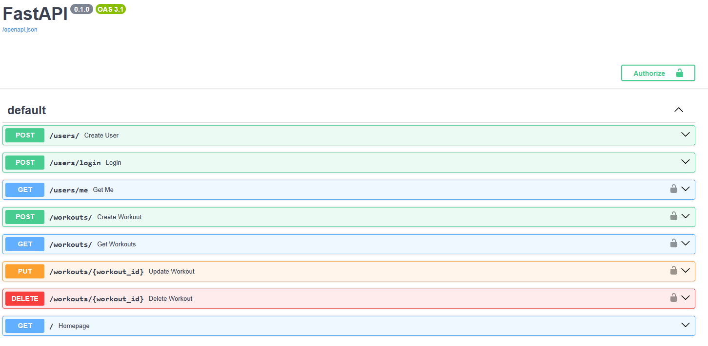

# FitnessApp

A backend API project built using FastAPI for managing users and workouts

## Features

- User Registration
- JWT authentication
- Login system
- Protected routes
- Create, read, update, delete workouts
- Workouts specific to each user
- Pagination
- SQLAlchemy
- SQLite Database

## API Preview

## Tech Stack

- FastApi
- SQLAlchemy
- SQLite
- JWT Authentication
- Passlib / bcrypt
- Pytest

## Installation

1. Clone the Repository:
git clone https://github.com/mpbe/FitnessApp.git

2. Create the virtual environment:
python -m venv venv

3. Activate environment:
venv\scripts\activate

4. Install dependencies:
pip install -r requirements.txt

5. Create .env and copy the contents of '.env.example' into it

6. Run server:
uvicorn app.main:app -reload

To test out the app, when the server is running navigate to:
http://127.0.0.1:8000/docs

## Future Improvements

- REACT frontend development
- PostgreSQL support
- Docker deployment

